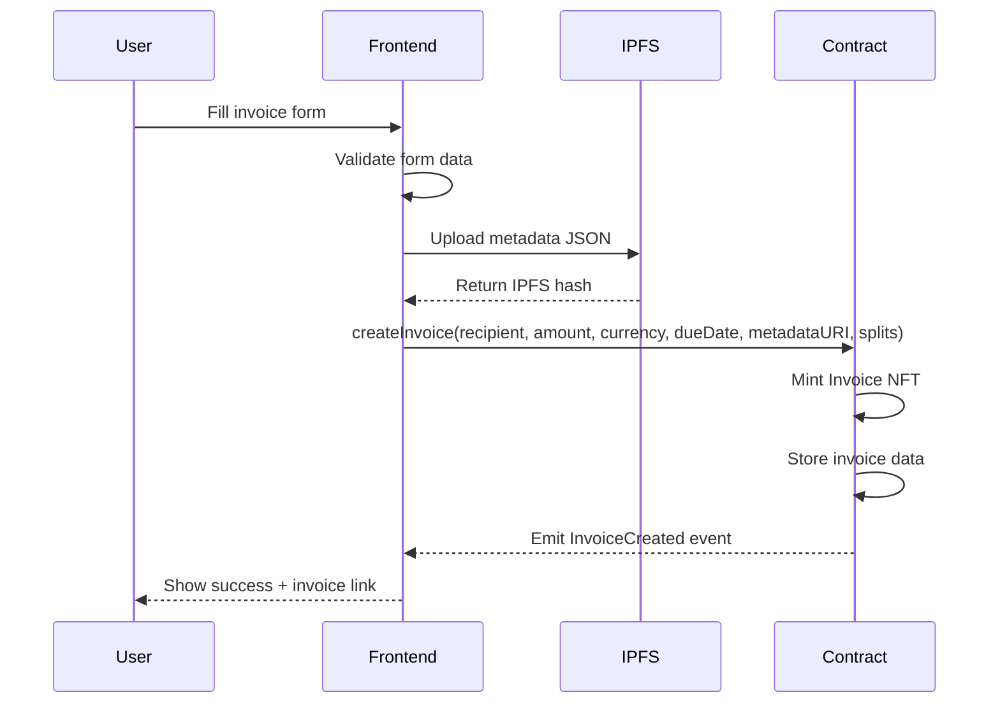
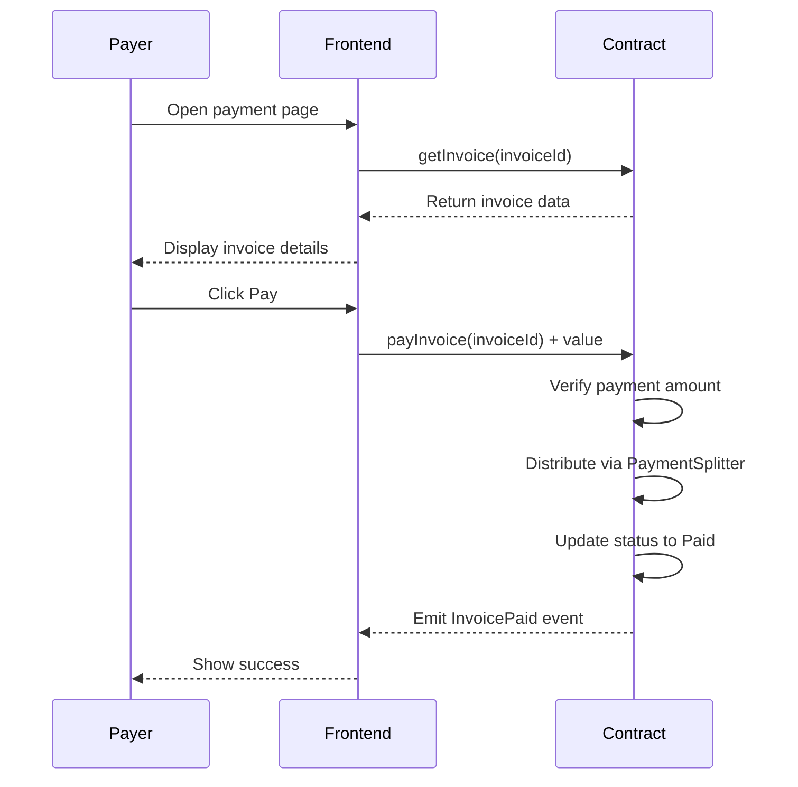
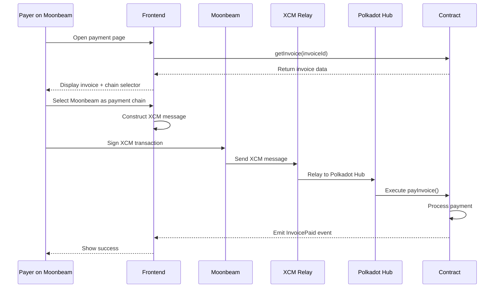

# Cross-Chain Invoice System - Architecture Document

## Project Overview

**Name:** InvoiceHub (or DotInvoice)

**Tagline:** "Create invoices on Polkadot Hub, get paid from any chain"

**Description:** A decentralized invoice management system that allows businesses, freelancers, and DAOs to create on-chain invoices as NFTs and receive payments from any Polkadot parachain via XCM.

---

## Target Hackathon Tracks

| Track | Eligibility | Prize Potential |
|-------|-------------|-----------------|
| Track 1: EVM Smart Contract | ✅ Stablecoin-enabled dApp | $3,000 |
| Track 3: Cross-chain Apps | ✅ XCM for payments | $5,000 |
| OpenZeppelin Sponsor | ✅ Heavy OZ usage | $1,000 |
| Best UI/UX | ✅ Clean dashboard | $500 |

**Maximum Prize Potential: $9,500**

---

## System Architecture

```
┌─────────────────────────────────────────────────────────────────────────────┐
│                              FRONTEND (Next.js)                              │
│  ┌─────────────┐  ┌─────────────┐  ┌─────────────┐  ┌─────────────┐        │
│  │  Dashboard  │  │Create Invoice│  │ Pay Invoice │  │  Analytics  │        │
│  └─────────────┘  └─────────────┘  └─────────────┘  └─────────────┘        │
└─────────────────────────────────────────────────────────────────────────────┘
                                      │
                                      ▼
┌─────────────────────────────────────────────────────────────────────────────┐
│                           POLKADOT HUB (EVM)                                 │
│  ┌─────────────────────────────────────────────────────────────────────┐   │
│  │                     SMART CONTRACTS (Solidity)                       │   │
│  │  ┌───────────────┐  ┌───────────────┐  ┌───────────────┐           │   │
│  │  │ InvoiceNFT.sol│  │PaymentRouter  │  │ InvoiceFactory│           │   │
│  │  │   (ERC721)    │  │   .sol        │  │     .sol      │           │   │
│  │  └───────────────┘  └───────────────┘  └───────────────┘           │   │
│  │  ┌───────────────┐  ┌───────────────┐                              │   │
│  │  │PaymentSplitter│  │ AccessControl │                              │   │
│  │  │   (OZ)        │  │    (OZ)       │                              │   │
│  │  └───────────────┘  └───────────────┘                              │   │
│  └─────────────────────────────────────────────────────────────────────┘   │
└─────────────────────────────────────────────────────────────────────────────┘
                                      │
                          XCM Messages │
                                      ▼
┌─────────────────────────────────────────────────────────────────────────────┐
│                           OTHER PARACHAINS                                   │
│  ┌─────────────┐  ┌─────────────┐  ┌─────────────┐  ┌─────────────┐        │
│  │  Moonbeam   │  │    Astar    │  │   Acala     │  │  Hydration  │        │
│  │   (GLMR)    │  │   (ASTR)    │  │   (ACA)     │  │   (HDX)     │        │
│  └─────────────┘  └─────────────┘  └─────────────┘  └─────────────┘        │
└─────────────────────────────────────────────────────────────────────────────┘
```

---

## Smart Contract Architecture

### Contract Hierarchy

```
┌─────────────────────────────────────────────────────────────────┐
│                        InvoiceFactory.sol                        │
│  - Creates new invoices                                          │
│  - Manages invoice registry                                      │
│  - Handles fee collection                                        │
└─────────────────────────────────────────────────────────────────┘
                              │
                              ▼
┌─────────────────────────────────────────────────────────────────┐
│                         InvoiceNFT.sol                           │
│  - ERC721URIStorage (OpenZeppelin)                               │
│  - ERC721Enumerable (OpenZeppelin)                               │
│  - AccessControl (OpenZeppelin)                                  │
│  - Pausable (OpenZeppelin)                                       │
│  - ReentrancyGuard (OpenZeppelin)                                │
│                                                                  │
│  Invoice Data:                                                   │
│  - invoiceId (tokenId)                                           │
│  - creator (address)                                             │
│  - recipient (address)                                           │
│  - amount (uint256)                                              │
│  - currency (address - ERC20 or native)                          │
│  - dueDate (uint256)                                             │
│  - status (enum: Pending, Paid, Cancelled, Overdue)              │
│  - metadata (IPFS hash for additional details)                   │
└─────────────────────────────────────────────────────────────────┘
                              │
                              ▼
┌─────────────────────────────────────────────────────────────────┐
│                       PaymentRouter.sol                          │
│  - Handles payment processing                                    │
│  - Integrates with PaymentSplitter (OpenZeppelin)                │
│  - Supports multiple currencies                                  │
│  - XCM payment verification                                      │
│  - Tax reserve allocation                                        │
└─────────────────────────────────────────────────────────────────┘
```

### OpenZeppelin Contracts Used

| Contract | Purpose | Customization |
|----------|---------|---------------|
| `ERC721URIStorage` | Invoice NFT base | Extended with invoice metadata |
| `ERC721Enumerable` | List user invoices | Standard usage |
| `AccessControl` | Role-based permissions | CREATOR_ROLE, ADMIN_ROLE |
| `PaymentSplitter` | Revenue distribution | Custom splits per invoice |
| `ReentrancyGuard` | Security | Payment functions |
| `Pausable` | Emergency stop | Admin controlled |
| `IERC20` | Token payments | Multi-currency support |
| `SafeERC20` | Safe transfers | All ERC20 operations |

---

## Data Models

### Invoice Structure (Solidity)

```solidity
struct Invoice {
    uint256 id;
    address creator;
    address recipient;
    uint256 amount;
    address currency;        // address(0) for native token
    uint256 dueDate;
    uint256 createdAt;
    uint256 paidAt;
    InvoiceStatus status;
    string metadataURI;      // IPFS hash
    PaymentSplit[] splits;   // Revenue distribution
}

struct PaymentSplit {
    address payee;
    uint256 shares;          // Basis points (10000 = 100%)
}

enum InvoiceStatus {
    Pending,
    Paid,
    Cancelled,
    Overdue,
    Disputed
}
```

### Invoice Metadata (IPFS JSON)

```typescript
interface InvoiceMetadata {
  title: string;
  description: string;
  items: InvoiceItem[];
  terms: string;
  notes: string;
  attachments: string[];     // IPFS hashes
  creatorInfo: {
    name: string;
    email: string;
    address: string;
    taxId?: string;
  };
  recipientInfo: {
    name: string;
    email: string;
    address: string;
  };
}

interface InvoiceItem {
  description: string;
  quantity: number;
  unitPrice: string;         // In smallest unit
  total: string;
}
```

---

## Frontend Architecture (Next.js + TypeScript)

### Project Structure

```
frontend/
├── src/
│   ├── app/                          # Next.js App Router
│   │   ├── layout.tsx
│   │   ├── page.tsx                  # Landing page
│   │   ├── dashboard/
│   │   │   ├── page.tsx              # Dashboard overview
│   │   │   ├── invoices/
│   │   │   │   ├── page.tsx          # Invoice list
│   │   │   │   ├── create/
│   │   │   │   │   └── page.tsx      # Create invoice
│   │   │   │   └── [id]/
│   │   │   │       └── page.tsx      # Invoice details
│   │   │   ├── payments/
│   │   │   │   └── page.tsx          # Payment history
│   │   │   └── settings/
│   │   │       └── page.tsx          # User settings
│   │   └── pay/
│   │       └── [id]/
│   │           └── page.tsx          # Public payment page
│   │
│   ├── components/
│   │   ├── ui/                       # Shadcn/ui components
│   │   ├── invoice/
│   │   │   ├── InvoiceCard.tsx
│   │   │   ├── InvoiceForm.tsx
│   │   │   ├── InvoicePreview.tsx
│   │   │   └── InvoiceStatus.tsx
│   │   ├── payment/
│   │   │   ├── PaymentModal.tsx
│   │   │   ├── CurrencySelector.tsx
│   │   │   └── ChainSelector.tsx
│   │   ├── wallet/
│   │   │   ├── ConnectButton.tsx
│   │   │   └── WalletProvider.tsx
│   │   └── layout/
│   │       ├── Header.tsx
│   │       ├── Sidebar.tsx
│   │       └── Footer.tsx
│   │
│   ├── hooks/
│   │   ├── useInvoice.ts
│   │   ├── usePayment.ts
│   │   ├── useWallet.ts
│   │   └── useXCM.ts
│   │
│   ├── lib/
│   │   ├── contracts/
│   │   │   ├── abi/
│   │   │   │   ├── InvoiceNFT.json
│   │   │   │   ├── InvoiceFactory.json
│   │   │   │   └── PaymentRouter.json
│   │   │   └── addresses.ts
│   │   ├── ipfs.ts
│   │   ├── xcm.ts
│   │   └── utils.ts
│   │
│   ├── types/
│   │   ├── invoice.ts
│   │   ├── payment.ts
│   │   └── contracts.ts
│   │
│   └── styles/
│       └── globals.css
│
├── public/
├── package.json
├── tsconfig.json
├── tailwind.config.ts
└── next.config.js
```

### Key Pages

| Page | Route | Description |
|------|-------|-------------|
| Landing | `/` | Marketing page with features |
| Dashboard | `/dashboard` | Overview with stats |
| Invoice List | `/dashboard/invoices` | All user invoices |
| Create Invoice | `/dashboard/invoices/create` | Invoice creation form |
| Invoice Detail | `/dashboard/invoices/[id]` | Single invoice view |
| Payment History | `/dashboard/payments` | All payments received |
| Public Pay | `/pay/[id]` | Public page for payers |

### Tech Stack

| Technology | Purpose |
|------------|---------|
| Next.js 14 | React framework with App Router |
| TypeScript | Type safety |
| Tailwind CSS | Styling |
| shadcn/ui | UI components |
| wagmi | Ethereum/EVM wallet connection |
| viem | Ethereum interactions |
| @polkadot/api | Polkadot interactions |
| @polkadot/extension-dapp | Polkadot wallet |
| react-hook-form | Form handling |
| zod | Validation |
| zustand | State management |
| tanstack/react-query | Data fetching |

---

## XCM Cross-Chain Flow

### Payment Flow from Another Parachain

```
┌─────────────────────────────────────────────────────────────────────────────┐
│                         CROSS-CHAIN PAYMENT FLOW                             │
└─────────────────────────────────────────────────────────────────────────────┘

1. User views invoice on Polkadot Hub
   │
   ▼
2. User selects payment chain (e.g., Moonbeam)
   │
   ▼
3. Frontend constructs XCM message:
   ┌─────────────────────────────────────────────────────────────────────────┐
   │  XCM Message:                                                           │
   │  - WithdrawAsset: GLMR from user account                               │
   │  - BuyExecution: Pay for XCM execution                                 │
   │  - DepositReserveAsset: Send to Polkadot Hub                          │
   │  - Transact: Call PaymentRouter.payInvoice()                          │
   └─────────────────────────────────────────────────────────────────────────┘
   │
   ▼
4. User signs transaction on Moonbeam
   │
   ▼
5. XCM relays message to Polkadot Hub
   │
   ▼
6. PaymentRouter receives payment:
   - Verifies invoice exists and is pending
   - Converts received asset if needed
   - Distributes to PaymentSplitter
   - Updates invoice status to Paid
   - Emits InvoicePaid event
   │
   ▼
7. Frontend updates UI via event subscription
```

### Supported Payment Chains (Initial)

| Chain | Native Token | Status |
|-------|--------------|--------|
| Polkadot Hub | DOT | ✅ Direct |
| Asset Hub | USDT, USDC | ✅ Direct |
| Moonbeam | GLMR | 🔄 XCM |
| Astar | ASTR | 🔄 XCM |
| Acala | ACA, aUSD | 🔄 XCM |

---

## User Flows

### Flow 1: Create Invoice



### Flow 2: Pay Invoice (Same Chain)



### Flow 3: Pay Invoice (Cross-Chain)



---

## Security Considerations

### Smart Contract Security

| Risk | Mitigation |
|------|------------|
| Reentrancy | ReentrancyGuard on all payment functions |
| Access Control | Role-based permissions (ADMIN, CREATOR) |
| Integer Overflow | Solidity 0.8+ built-in checks |
| Front-running | Commit-reveal for sensitive operations |
| Pausability | Emergency pause by admin |

### Frontend Security

| Risk | Mitigation |
|------|------------|
| XSS | React's built-in escaping + CSP headers |
| CSRF | SameSite cookies + CSRF tokens |
| Wallet Phishing | Verify contract addresses |
| Data Integrity | Validate all inputs with Zod |

---

## Development Phases

### Phase 1: Core Contracts (Days 1-2)
- [ ] InvoiceNFT.sol with OpenZeppelin
- [ ] InvoiceFactory.sol
- [ ] PaymentRouter.sol
- [ ] Unit tests with Foundry

### Phase 2: Frontend Foundation (Days 2-3)
- [ ] Next.js project setup
- [ ] Wallet connection (wagmi)
- [ ] Basic UI components
- [ ] Contract integration

### Phase 3: Core Features (Days 3-4)
- [ ] Create invoice flow
- [ ] Pay invoice flow (same chain)
- [ ] Invoice listing and details
- [ ] Payment history

### Phase 4: Cross-Chain (Day 5)
- [ ] XCM integration
- [ ] Multi-chain payment support
- [ ] Chain selector UI

### Phase 5: Polish (Day 6)
- [ ] UI/UX improvements
- [ ] Documentation
- [ ] Demo video
- [ ] Testnet deployment

---

## Deployment

### Contracts
- Network: Polkadot Hub Testnet
- Framework: Foundry
- Verification: Blockscout

### Frontend
- Platform: Vercel
- Domain: invoicehub.vercel.app (or custom)

### IPFS
- Provider: Pinata or web3.storage
- Purpose: Invoice metadata storage

---

## Success Metrics

| Metric | Target |
|--------|--------|
| Invoice Creation | < 2 clicks from dashboard |
| Payment Time | < 30 seconds (same chain) |
| Cross-chain Payment | < 2 minutes |
| Gas Efficiency | < 200k gas for invoice creation |
| UI Response | < 100ms for all interactions |

---

## Future Roadmap (Post-Hackathon)

1. **Recurring Invoices** - Subscription billing
2. **Invoice Templates** - Save and reuse
3. **Multi-signature Approval** - For enterprise
4. **Fiat Off-ramp** - Convert to fiat
5. **Accounting Integration** - Export to QuickBooks, Xero
6. **Mobile App** - React Native version
7. **DAO Treasury Integration** - Native DAO support

---

## Resources

- [OpenZeppelin Contracts](https://docs.openzeppelin.com/contracts)
- [Polkadot Hub Docs](https://wiki.polkadot.network)
- [XCM Documentation](https://wiki.polkadot.network/docs/learn-xcm)
- [wagmi Documentation](https://wagmi.sh)
- [Next.js Documentation](https://nextjs.org/docs)
